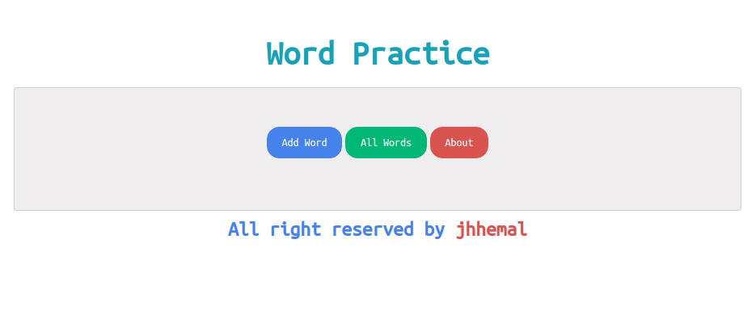

# Django Word Practice Application.

## How To Setup On Linux
1. Clone This Project `git clone https://github.com/jhhemal/wordpractice.git`
2. Go to Project Directory `cd wordpractice`
3. Create a Virtual Environment `python3 -m venv venv`
4. Activate Virtual Environment `source venv/bin/activate`
5. Install Requirements Package `pip install -r requirements.txt`
6. Migrate Database `python manage.py migrate`
7. Create Super User ~~`python manage.py createsuperuser`~~ 
8. Finally Run The Project `python manage.py runserver`

## Simple Demo

